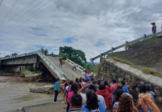
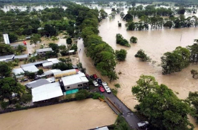
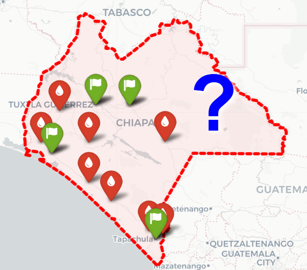
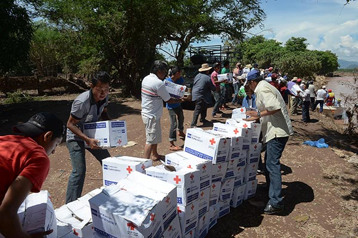
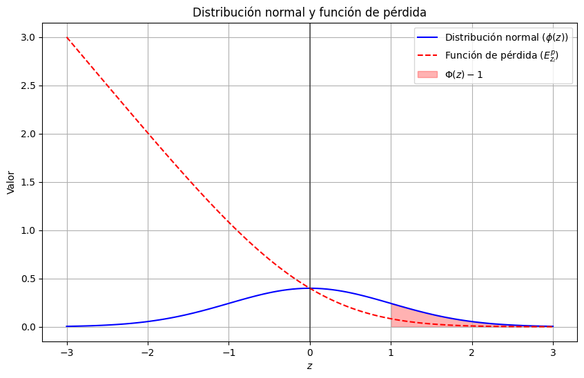
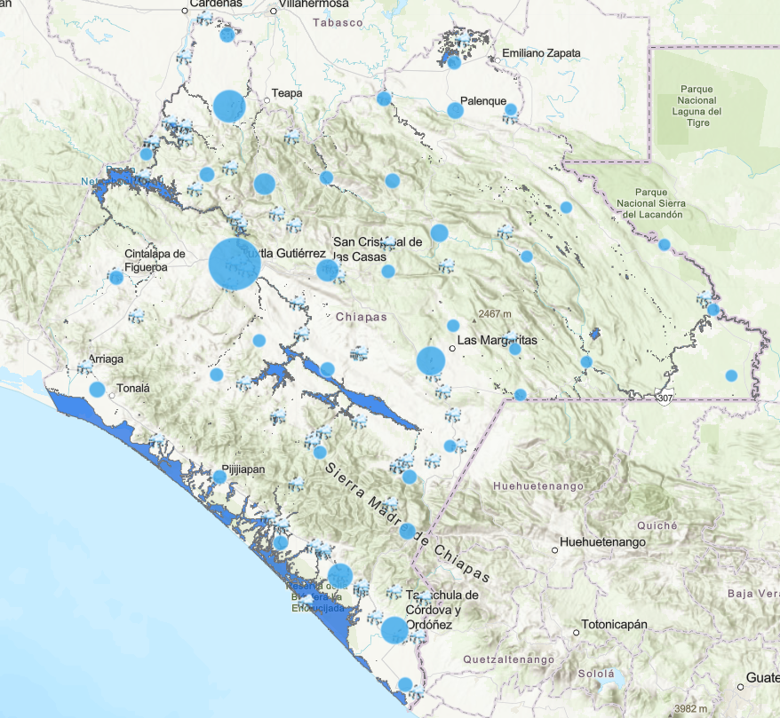
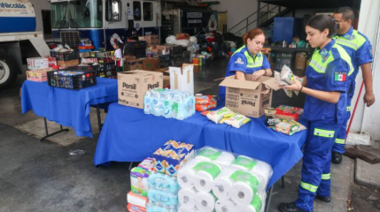
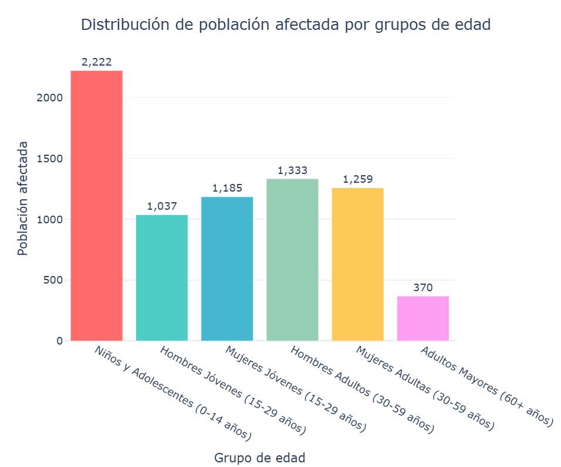
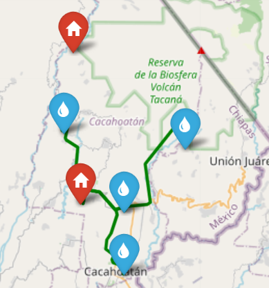
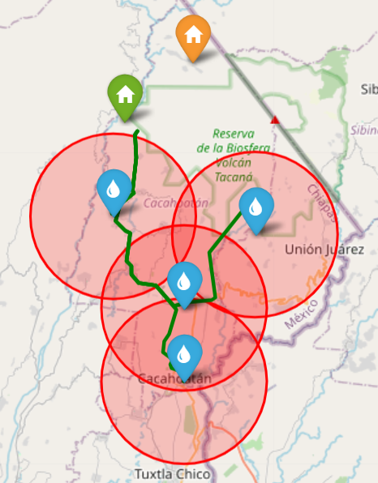

## Contenido

1. Introducción 
2. Marco Teórico: Problema de Localización
3. Modelo de Inventarios EOQ Estocástico
4. Función Objetivo Integrada
5. Métricas de Desempeño
6. Aplicación en Chiapas
7. Escenarios Evaluados
8. Conclusiones
9. Referencias

## Introducción
::: {.columns}

:::: {.column width="60%" .center}
\justifying
\setstretch{1.3}

La alta recurrencia de inundaciones y deslizamientos en \textbf{Chiapas} afecta comunidades vulnerables. Este estudio busca optimizar la respuesta humanitaria mediante la planificación previa, la ubicación estratégica de almacenes y la gestión eficiente de recursos.

{width=55%}
::::

:::: {.column width="40%" .center}
{width=100%}
{width=100%}
::::

:::

## Objetivos

::: {.columns}
:::: {.column width="55%"}
\textbf{Objetivo General:}

Modelo integrado de ubicación de almacenes + inventario humanitario para zonas inundables en el sureste de México.
::::

:::: {.column width="45%"}
\centering
{width=80%}
::::
:::
\textbf{Objetivos Específicos:}

\begin{enumerate}
\item \textbf{Adaptar EOQ:} incluir inventario de seguridad y penalización por faltantes.

\item \textbf{Desarrollar esquema híbrido:} MINLP + L-BFGS-B para subproblemas continuos.

\item \textbf{Verificar desempeño:} casos de estudio en Veracruz y Chiapas.
\end{enumerate}

## Marco Teórico: Problema de Localización

\justifying

**Conjuntos:**

- $\mathcal{I}$: Almacenes candidatos
- $\mathcal{J}$: Localidades demandantes
- $\mathcal{P}$: Productos humanitarios

**Variables:**

- $x_i \in \{0,1\}$: ¿Abrir almacén en $i$?
- $y_{ij} \geq 0$: Flujo $i \to j$

**Parámetros clave:**

- $w_i$: Peso posicional (aptitud logística)
- $c_{ij}$: Costo unitario de transporte
- $f_i$: Costo fijo de apertura
- $d_j$: Demanda esperada en $j$

## Restricciones del Modelo

\justifying

**1. Balance de Inventario:**
$$\sum_{j} x_{ij} \leq I_i \quad \forall i$$

**2. Cobertura de Demanda:**
$$\sum_{i} x_{ij} + z_j = s_j \quad \forall j$$

**3. Activación Condicional (Big-M):**
$$x_{ij} \leq M \cdot y_i \quad \forall i, j$$

**4. Capacidad Máxima:**
$$I_i \leq C_i \cdot y_i \quad \forall i$$

\vspace{0.3cm}
\alert{Nota:} $M$ es una constante suficientemente grande.

## Modelo de Inventarios EOQ con demanda Estocástica
::: {.columns}
:::: {.column width="50%"}

**Cantidad Económica de Pedido:**
$$Q^* = \sqrt{\frac{2DS}{H}}$$

**Componentes:**

- $D$: Demanda anual del producto
- $S$: Costo de ordenar por pedido
- $H$: Costo de mantener inventario
::::

:::: {.column width="50%"}
{width=85%}
::::

:::

 **Adaptación para Contexto Humanitario**

- **Demanda estocástica** por incertidumbre en afectación
- **Horizonte temporal** ajustado a emergencias
- **Múltiples productos** con características diferentes

## Inventario de Seguridad y Punto de Reorden

::: {.columns}
:::: {.column width="50%"}
**Inventario de Seguridad:**
$$SS = Z_{\alpha} \cdot \sigma_d \cdot \sqrt{L}$$

**Punto de Reorden:**
$$R = d \cdot L + SS$$
::::

:::: {.column width="50%"}
\centering
{width=85%}
::::
:::

**donde:**

- $Z_{\alpha}$: Valor Z para nivel de servicio $\alpha$ (95%)
- $\sigma_d$: Desviación estándar de demanda diaria
- $L$: Tiempo de entrega en días
- $d$: Demanda diaria promedio

## Función de Pérdida Normal

Para estimar el riesgo de escasez, usamos la función de pérdida asociada a
la distribución normal:

::: {.columns}
:::: {.column width="40%"}
$$E[Z] = \phi(Z) - Z(1 - \Phi(Z))$$
::::
:::: {.column width="60%"}
{width=100%}
::::
::::

**Aplicación en Fill Rate:**

- **Fill Rate** proporción de demanda satisfecha
- **Relación directa** con nivel de servicio
- **Base para cálculo** de costos por escasez

## Función Objetivo Integrada

\justifying

**Minimización de Costos Totales:**

$$
\min Z = \sum_{i \in I} f_i Y_i + \sum_{i \in I} \sum_{j \in J} w_i c_{ij} Y_{ij} + \sum_{i \in I} \sum_{p \in P} TC_{ip}
$$

**Componentes:**

| Término | Descripción |
|---------|-------------|
| $\sum f_i Y_i$ | Costo fijo de apertura de almacenes |
| $\sum w_i c_{ij} Y_{ij}$ | Costo de transporte ponderado por aptitud logística |
| $\sum TC_{ip}$ | Costo total de inventario por producto |

\vspace{0.3cm}
\alert{Objetivo:} Balancear inversión en infraestructura, operación logística y nivel de servicio.

## Componentes del Costo de Inventario

$$
TC_{ip} =
{\color{blue}\frac{C^{op}_i D^p_j}{Q^p_{ij}} +
C^{sp}_i \left(\frac{Q^p_{ij}}{2} + SS\right) +
C^p_i D^p_j} {\color{red}+
\frac{D^p_j}{Q^p_{ij}} (C^f_i + \sigma_d E[Z] B)}
$$

- ${\textcolor{blue}{\textbf{Costo de pedido o preparación}}}$: se reduce al aumentar la cantidad pedida.  
- ${\textcolor{blue}{\textbf{Costo del mantenimiento o almacenamiento}}}$: considerando el inventario promedio y la seguridad $SS$.  
- ${\textcolor{blue}{\textbf{Costo de adquisición}}}$: asociado a la demanda esperada $D^p_j$ del producto $p$.  
- ${\textcolor{red}{\textbf{Costo esperado de faltante}}}$: incorpora la variabilidad de la demanda $\sigma_d$ y el costo unitario de escasez $B$.  

## Peso Posicional ($w_i$)
::: {.columns}
:::: {.column width="50%"}
**Multicriterio para Selección**

Componentes del Peso Posicional $w_i$:

- **Accesibilidad por carretera** 
- **Existencia de servicios básicos**
- **Infraestructura disponible**
- **Población**
::::

:::: {.column width="50%"}
{width=85%}
::::

:::

**Objetivo:**

Priorizar localidades con **mayor capacidad logística** y **menor vulnerabilidad estructural**

## Métricas de Desempeño

**Fill Rate del Sistema:**
$$FR_{sistema} = \frac{\sum_{i \in I} \sum_{p \in P} D_{ip} \cdot FR_{ip}}{\sum_{i \in I} \sum_{p \in P} D_{ip}}\text{,}$$

**Costo Total por Persona Atendida:**
$$Costo_{pe} = \frac{Costo_{t}}{Poblacion_{a}}\text{,}$$

**Tiempo Promedio de Respuesta:**
$$T_{respuesta} = \frac{\sum_{i \in I} \sum_{j \in J} t_{ij} \cdot Y_{ij}}{\sum_{i \in I} \sum_{j \in J} Y_{ij}}\text{,}$$

donde:

- $t_{ij}$ : tiempo de transporte (horas) desde el almacén $𝑖$  hasta la zona afectada $𝑗$.

## ¿Por qué L-BFGS-B para este problema?

::: {.columns}
:::: {.column width="50%"}
\textbf{Desafíos del modelo:}
\begin{itemize}
\item Función no convexa y no separable
\item Variables con cotas ($Q \geq 1$, $s_i \geq 0$)
\item Gran escala (miles de variables)
\item Convergencia garantizada
\end{itemize}
::::

:::: {.column width="50%"}
\textbf{Ventajas de L-BFGS-B:}
\begin{itemize}
\item \textcolor{blue}{Memoria limitada:} $O(mn)$ vs $O(n^2)$
\item \textcolor{green}{Manejo de cotas:} proyección $P_\Omega$
\item \textcolor{red}{Convergencia superlineal}
\item \textcolor{orange}{Eficiencia:} 7 iter. vs 1,183 (Gradiente)
\end{itemize}
::::
:::

## Método de Solución: Algoritmo L-BFGS-B

::: {.columns}
:::: {.column width="55%"}
\justifying
\setstretch{1.3}

\textbf{¿Por qué este método?}
\begin{itemize}
\item Problema \textbf{MINLP} con variables continuas y cotas ($Q \geq 1$)
\item Función objetivo no convexa globalmente
\item Necesidad de convergencia garantizada
\end{itemize}
::::

:::: {.column width="45%"}
\justifying
\setstretch{1.3}

\textbf{Fundamento Teórico:}

\begin{itemize}
\item \textbf{Proyección ortogonal:} mantiene factibilidad en cada iteración
\item \textbf{Aproximación del Hessiano:} usa información de curvatura sin calcularla explícitamente
\item \textbf{Condiciones KKT:} garantiza optimalidad bajo restricciones
\end{itemize}
::::
:::

## Fundamentos Cuasi-Newton

\justifying

\textbf{Idea central:} Aproximar el Hessiano sin cálculo explícito

\vspace{0.3cm}
\textbf{Ecuación secante:}
$$B_{k+1} s_k = y_k$$

donde $s_k = x_{k+1} - x_k$, $y_k = \nabla f(x_{k+1}) - \nabla f(x_k)$

\vspace{0.3cm}
\textbf{Actualización BFGS:}
$$H_{k+1} = (I - \rho_k s_k y_k^\top) H_k (I - \rho_k y_k s_k^\top) + \rho_k s_k s_k^\top$$
$$\rho_k = (y_k^\top s_k)^{-1}$$

\textbf{Ventajas:}
\begin{itemize}
\item \textbf{Convergencia superlineal:} más rápido que gradiente descendente
\item \textbf{Sin Hessiano explícito:} reduce costo computacional
\item \textbf{Invariancia afín:} independiente del escalado de variables
\end{itemize}

\vspace{0.3cm}
\alert{Condición de curvatura:} $y_k^\top s_k > 0$ (garantizada por Wolfe)

## Restricciones Tipo Caja y Proyección Ortogonal

::: {.columns}
:::: {.column width="45%"}
\justifying

\textbf{Dominio factible con cotas:}
$$\Omega = \{x \in \mathbb{R}^n \mid \ell_i \leq x_i \leq u_i\}$$

\textbf{Ejemplos en nuestro modelo:}
\begin{itemize}
\item $Q \geq 1$ (al menos una unidad de inventario)
\item $s_i \geq 0$ (inventario no negativo)
\item $y_{ij} \geq 0$ (flujos no negativos)
\end{itemize}

\vspace{0.3cm}
\textbf{Proyección ortogonal:}
$$P_\Omega(z) = \arg\min_{x \in \Omega} \frac{1}{2}\|x - z\|^2$$
::::

:::: {.column width="45%"}
\justifying

\textbf{Fórmula explícita (componente a componente):}
$$[P_\Omega(z)]_i = \min\{u_i, \max\{\ell_i, z_i\}\}$$

\textbf{Propiedades clave:}
\begin{itemize}
\item \textbf{No expansividad:} $\|P_\Omega(z) - P_\Omega(w)\| \leq \|z-w\|$
\item \textbf{Mantiene factibilidad:} $x_{k+1} \in \Omega$ en cada iteración
\item \textbf{Condiciones KKT:} equivalen a estacionariedad proyectada
\end{itemize}

\vspace{0.3cm}
\alert{Ventaja:} Proyección simple y eficiente ($O(n)$)
::::
:::

## Condiciones KKT para Problemas con Cotas

\justifying

\textbf{Condiciones por componente ($i$):}

\begin{itemize}
\item \textbf{Interior:} $\nabla_i f(x^*) = 0$ si $\ell_i < x^*_i < u_i$
\item \textbf{Cota inferior:} $\nabla_i f(x^*) \geq 0$ si $x^*_i = \ell_i$
\item \textbf{Cota superior:} $\nabla_i f(x^*) \leq 0$ si $x^*_i = u_i$
\end{itemize}

\vspace{0.1cm}
\textbf{Interpretación:}
El gradiente debe apuntar \textbf{hacia adentro} del dominio factible en las fronteras.

\textbf{Estacionariedad Proyectada:}

$$\nabla_\Omega f(x^*) := P_\Omega(x^* - \nabla f(x^*)) - x^* = 0$$

\vspace{0.1cm}
\textbf{Criterio de Convergencia:}

El algoritmo se detiene cuando:
$$\|\nabla_\Omega f(x_k)\| \leq \varepsilon$$

## Teorema de Convergencia Global
\justifying

**Hipótesis (Byrd et al., 1995):**

\begin{itemize}
\item[(H1)] Gradiente Lipschitz-continuo en $\Omega$
\item[(H2)] Conjunto de nivel inicial compacto
\item[ ] Búsqueda lineal satisface condiciones de Wolfe
\end{itemize}

\vspace{0.1cm}
**Garantía teórica:**
El algoritmo no diverge y encuentra puntos estacionarios factibles.

**Resultado (Teorema 6.2):**
$$\liminf_{k \to \infty} \|\nabla_\Omega f(x_k)\| = 0$$

**Interpretación:**
Toda subsucesión convergente satisface las condiciones **KKT**.

\alert{Importancia:} Valida que la solución numérica obtenida es óptima bajo restricciones de caja.

## Implementación Computacional: Entorno y Herramientas

::: {.columns}
:::: {.column width="50%"}
\justifying
\setstretch{1.3}

\textbf{Lenguaje y Versión:}
\begin{itemize}
\item Python 3.12
\item Librerías científicas estándar
\end{itemize}

\vspace{0.3cm}
\textbf{Librerías Principales:}
\begin{itemize}
\item \textbf{NumPy:} operaciones algebraicas y matrices
\item \textbf{Pandas:} manipulación de datos estructurados
\item \textbf{SciPy (optimize):} algoritmos de optimización numérica
\item \textbf{Matplotlib:} visualización de resultados
\item \textbf{Folium:} mapas interactivos de la red logística
\end{itemize}
::::

:::: {.column width="50%"}
\justifying
\setstretch{1.3}

\textbf{Hardware de Ejecución:}
\begin{itemize}
\item Sistema operativo: Windows 11
\item Procesador: arquitectura x64
\item Memoria RAM: 16 GB
\end{itemize}

\vspace{0.5cm}
\textbf{Ventajas de Python:}
\begin{itemize}
\item Reproducibilidad de resultados
\item Transparencia en la investigación
\item Amplia documentación científica
\item Integración con herramientas GIS
\end{itemize}
::::
:::

## Implementación Computacional: Estructura y Parámetros

::: {.columns}
:::: {.column width="55%"}
\justifying
\setstretch{1.3}

\textbf{Estructura Modular (6 etapas):}
\begin{enumerate}
\item Entrada de datos (demanda, costos, tiempos)
\item Preprocesamiento y normalización
\item Definición de función objetivo y restricciones
\item Configuración de cotas ($Q \geq 1$, $s_i \geq 0$)
\item Ejecución del algoritmo L-BFGS-B
\item Salida y análisis de resultados
\end{enumerate}
::::

:::: {.column width="45%"}
\justifying
\setstretch{1.3}

\textbf{Parámetros del Algoritmo:}
\begin{itemize}
\item Memoria limitada: $m = 10$
\item Tolerancia de convergencia: $\varepsilon = 10^{-6}$
\item Condiciones de Wolfe para búsqueda lineal
\item Inicialización escalada: $H_k^{(0)} = \gamma_k I$
\end{itemize}
::::
:::

## Aplicación en Chiapas
::: {.columns}
:::: {.column width="60%"}
\justifying
**Características de Chiapas:**

- **Alta vulnerabilidad** a inundaciones y deslizamientos
- **Topografía compleja** que afecta accesibilidad
- **Población dispersa** en comunidades rurales
- **Recursos limitados** para logística humanitaria

**Productos Humanitarios Considerados:**

- Agua potable (2 litros/persona/día)
- Alimentos no perecederos
- Kits de medicamentos básicos
- Ropa y cobijas
- Artículos de higiene personal
::::

:::: {.column width="40%"}
{width=80%}
{width=100%}
::::

:::

## Grupo de edades y productos específicos
::: {.columns}
:::: {.column width="40%"}
\justifying
**Observaciones clave:**

- Necesidades varían según **edad**: niños, adultos y ancianos.  
- **Mujeres** requieren kits de higiene distintos a los hombres.  
- La logística debe planificar la **distribución según edad y género** para optimizar recursos.
::::

:::: {.column width="60%"}
{width=100%}
::::

:::

## Cálculo del Peso Posicional — Caso Chiapas

El peso posicional $w_j$ integra cinco dimensiones logísticas de relevancia humanitaria, cada una con ponderación del 20 %. Se normalizaron todas las variables en el rango $[0,1]$:

$$w_i = 0.20 (Diconsa_i +  AccesoVial_i +  Escuelas_i +  Servicios_i + Poblacion_i)$$

**Top 5 localidades con mayor potencial logístico (Cacahoatán):**

| **#** | **Localidad** | **Peso** |
|:--:|:----------------|:--:|
| 1 | Salvador Urbina | **1.000** |
| 2 | Faja de Oro | **0.983** |
| 3 | Cacahoatán | 0.849 |
| 4 | Rosario Ixtal | 0.749 |
| 5 | Mixcum | 0.657 |

## Escenarios Evaluados — Cacahoatán

**Objetivo:** Analizar la sensibilidad del modelo ante restricciones espaciales.

🔹 Escenario A: Sin radio de afectación

- Se evaluaron **2 almacenes candidatos**.  
- El modelo seleccionó **1 almacén óptimo** que cubre las 4 localidades.  
- Solución **eficiente en costo** y **plena cobertura** del territorio.

::: {.columns}
:::: {.column width="60%"}
| Indicador | Resultado |
|-----------|-----------|
| Cobertura | 100 % |
| Población atendida | 7,407 personas |
| Localidades cubiertas | 4 |
| Fill rate promedio | 100 % |
| Costo total anual | \$195,459,693 MXN |
::: 
:::: {.column width="40%"}
{width=80%}
::: 
::: 
 

## Continuación Escenarios Evaluados — Cacahoatán
::: {.columns}
:::: {.column width="50%"}

🔹 Escenario B: Con radio de afectación $r = 5$ km

- El **almacén 1** queda **dentro del radio de influencia** del segundo.  
- El modelo selecciona el **almacén 2** como óptimo.  
- Se mantiene **cobertura total**, pero con **mayor eficiencia espacial**.
::: 
:::: {.column width="50%"}
{width=70%}
:::
:::

::: {.block data-bg="gray!10"}
 La restricción geográfica redefine la ubicación óptima, evidenciando la importancia de integrar criterios espaciales en la localización humanitaria.
:::

## Análisis de Sensibilidad

**Factor de Afectación:**

- Escenario base: **30%** de población afectada
- Análisis de sensibilidad: **20% - 50%**

**Nivel de Servicio:**

- Objetivo principal: **95%** fill rate
- Variación: **90% - 99%**

**Número de Almacenes:**

- Rango evaluado: **1-2 almacenes**
- Trade-off: **Costo vs. Cobertura**

## Conclusiones

 Hallazgos Principales

**Efectividad del Modelo:**

- **Integración exitosa** de localización e inventario
- **Balance óptimo** entre costos y nivel de servicio
- **Aplicabilidad práctica** en contextos reales

**Contribuciones:**

- **Un marco decisional** para planificación pre-desastre
- **Herramienta cuantitativa** para agencias humanitarias
- **Base metodológica** replicable en otros municipios

\vspace{1em}

\begin{block}{}
\centering
\large
\textit{
“Tanto en Chiapas como en Veracruz, los desastres seguirán ocurriendo, pero la preparación puede marcar la diferencia.”
}
\end{block}

## Recomendaciones para Cacahoatán

- **Implementar configuración** de un almacén
- **Mantener inventarios** según cálculo EOQ con demanda Estocástica
- **Monitorear continuamente** factores de riesgo

## Referencias
::: {#refs}
:::